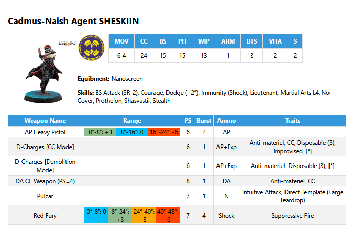

# Infinity Data
 A program to convert the unit data from Corvus Bellis Army Builder for the Infinity tabletop game.

Currently, the main function to take an army code and to generate nice printable cards for all the units in the army. 

If Corvus Belli provides an image for the unit profile it is included into the card. 

The default implementation creates the cards in the size of a third of a A4 page, so 9 fit on one page for printing.

The cards look like this:

[kestrel army.pdf](kestrel.pdf)

Contributions of every kind are welcome, especially if somebody has experience in HTML layout and want to help to make the cards to look nicer.

Based on https://github.com/cwoac/Infinity-Army-Tools
