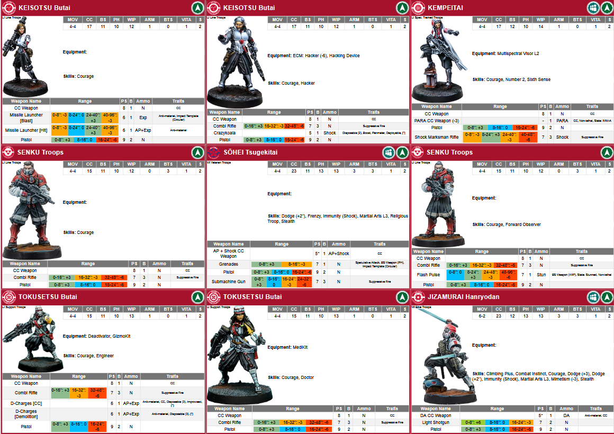

# Infinity Data

A program to convert unit data from Corvus Belli's Army Builder for the Infinity tabletop game.

Currently, the main function is to take an army code and generate nice, printable cards for all the units in the army.

If Corvus Belli provides an image for the unit profile, it is included in the card.

The default implementation creates the cards in the size of one-third of an A4 page, so 9 cards fit on one page for
printing.

The cards for the army code:

``hE0DanNhASCBLAIBAQAIAICQAQMAAICQAQQAAICTAQUAAIcZAQEAAIb%2FAQEAAIcZAQYAAICeAQIAAICeAQEAAgEABwCHHQEBAACHHAEDAACD6gEBAACApAECAACHIQECAACA3wEBAACAmAECAA%3D%3D``

look like this:

or as pdf: [JSA-inch.pdf](JSA-inch.pdf)

## Usage

The card generator is available under https://infinity.2nirwana.de/cards/ , simply insert your army code, select your
options (card style, inch/cm, all/distinct) and generate the cards. A new browser tap opens with the cards. Simply
print them from your browser to pdf or on paper by selecting 9 on one-page option of the print dialoge.

## Development

Contributions of any kind are welcome, especially if someone has experience in HTML layout and wants to help make the
cards look nicer.

Based on [Infinity-Army-Tools](https://github.com/cwoac/Infinity-Army-Tools)